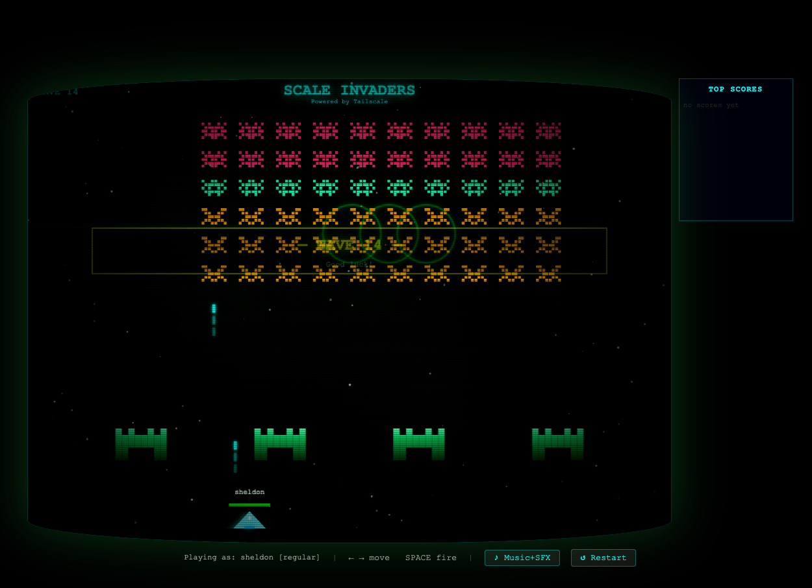

# Scale Invaders

A multiplayer arcade shooter for your Tailscale network.

> **Disclaimer:** This project is a personal toy created with generative AI assistance.

## What it is

Scale Invaders is a browser-based arcade game where every player on your tailnet gets a ship and competes in a shared game world. Players are randomly assigned to the defender or invader team and can switch sides on death. Enemies advance in waves, shields provide cover, and bonus critters fly across the field for extra points.

## Why Tailscale

The game server uses [tsnet](https://pkg.go.dev/tailscale.com/tsnet) to run entirely inside your tailnet — it never listens on the public internet. When a player connects, the server calls `WhoIs` to look up their Tailscale identity and uses it as their in-game name. No logins, no accounts, no configuration: if you're on the tailnet, you can play.

## Screenshot




## Controls

| Key | Action |
|-----|--------|
| ← → | Move left / right |
| ↑ ↓ | Move up / down (invader team only) |
| Space | Fire |
| ↺ Restart button | Reset the game |

### Secret shortcuts

| Key | Action |
|-----|--------|
| `b` / `B` | Swap between defender and invader team |
| `m` | Advance music to next wave track |
| `Shift+M` | Reset music back to wave 1 track |
| `Shift+W` | Skip to the next wave immediately |
| `Shift+C` | Toggle CRT screen effect |

## Requirements

- Go 1.21 or later
- A Tailscale auth key ([create one here](https://login.tailscale.com/admin/settings/keys))

### Getting Go

If `go version` returns a not-found error, install Go from the official site:

- **All platforms:** download an installer from [go.dev/dl](https://go.dev/dl/) and follow the instructions for your OS.
- **macOS (Homebrew):** `brew install go`
- **Linux (apt):** `sudo apt install golang-go` (may lag behind latest; prefer the tarball from go.dev/dl if you need 1.21+)
- **Windows:** use the `.msi` installer from go.dev/dl; the installer adds Go to your PATH automatically.

After installation, open a new terminal and confirm with `go version`.

## Build

```bash
git clone <this-repo>
cd invaders
go mod download
go build -o invaders .
```

The `static/index.html` frontend is embedded into the binary at build time, so the single `invaders` executable is all you need to distribute or deploy.

## Run

```bash
TS_AUTHKEY=<your-authkey> ./invaders
```

On first run without an auth key the server prints a login URL — authenticate in a browser, then re-run. Once started, open `http://invaders` (MagicDNS) or `http://<machine-ip>` from any device on your tailnet to play.
